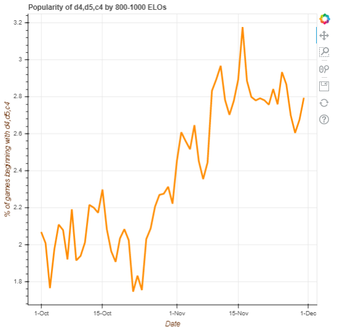

# chess-opening-popularity
chess-opening-explorer is a python app that maps the popularity of an opening, or set of openings, over a period of time.

## Insipiration and Example
Online chess traffic has increased nearly 40% month-over-month since the release of Netflix's The Queen's Gambit on Oct. 23, 2020. In the final match played by the main character, Beth Harmon, she opens with the Queen's Gambit (1. d4 d5 2. c4).  This project was built to investigate the popularity of the Queen's Gambit opening since the release of the Netflix miniseries.

By comparing all games played on lichess.org over the past two months we can compare the popularity of the an opening by parsing the relevant notation and using it to increment a value in a dictionary.

## Installation
1. Dowlnoad the full record of games for Oct, Nov from https://database.lichess.org/ (~1.5B games!). Unzip the files to ./data
2. Clone the repo.
3. Run the requirements script to install any required packages.
4. Run the code from cmd or the IDE of you choice.
